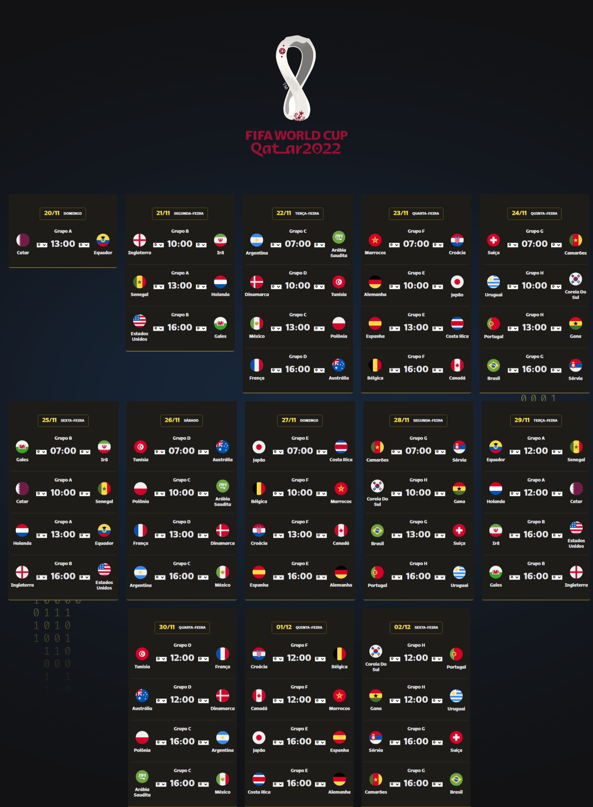

<h1 align="center"> NLW 10 Copa </h1>

Evento exclusivo e gratuito, promovido pela Rocketseat para ensino de tecnologias WEB.

  <a href="#-tecnologias">Tecnologias</a>&nbsp;&nbsp;&nbsp;|&nbsp;&nbsp;&nbsp;
  <a href="#-projeto">Projeto</a>&nbsp;&nbsp;&nbsp;|&nbsp;&nbsp;&nbsp;
  <a href="#-layout">Layout</a>&nbsp;&nbsp;&nbsp;|&nbsp;&nbsp;&nbsp;
  <a href="#memo-licença">Licença</a>

  

 

  

## 🚀 Tecnologias

Esse projeto foi desenvolvido com as seguintes tecnologias:

- HTML e CSS
- JavaScript
- Git e Github

## 💻 Projeto

A Tabela da Copa do Mundo 2022 Qatar é um projeto que traz de forma digital, a antiga "tabelinha da copa" entregue de forma impressa nos estabelecimentos comerciais. Aqui você pode acompanhar a data dos jogos e anotar os resultados das partidas. Essa será sua colinha desde o primeiro até o último dia de jogo. #rumoaohexa

## 🔖 Layout

Você pode visualizar o layout do projeto através [DESSE LINK](https://www.figma.com/file/goFDyVbmwhpKna2L35EHFs/Calend%C3%A1rio-de-Jogos-(Community)/duplicate). É necessário ter conta no [Figma](https://figma.com) para acessá-lo.

## :memo: Licença

Esse projeto está sob a licença MIT.
